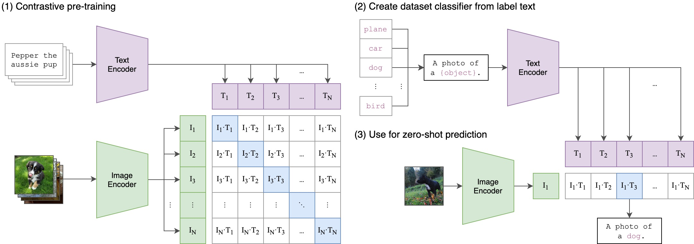
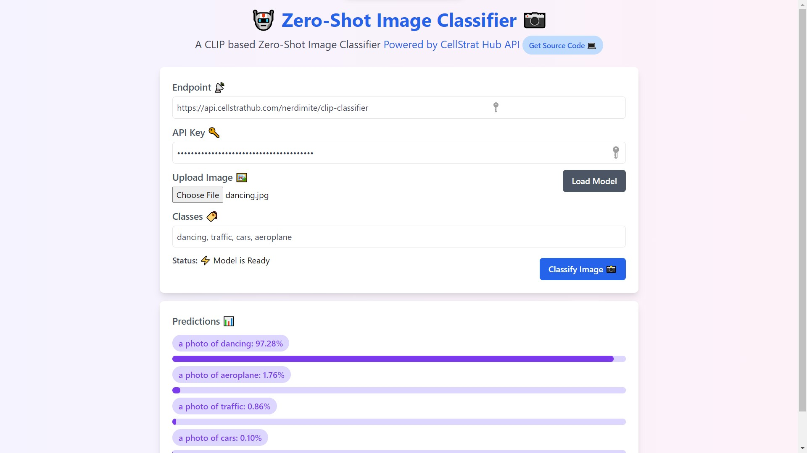

# Zero-Shot Image Classifier Deployment

This repository contains the End-to-End source code for deploying a Zero-Shot Image Classifier using CLIP as a REST API using [CellStrat Hub](https://cellstrathub.com) and integrating the API into a Nextjs (React) App.

This code was presented as part of the [Workshop on CellStrat Hub API](https://www.meetup.com/Disrupt-4-0/events/281691990/)

## CLIP Architecture

## Usage

### Development

- Run the [CLIP.ipynb Notebook](model_src/CLIP.ipynb) to see how CLIP is used for Zero-Shot Image Classification.
- The [`inference.py module`](model_src/inference.py) is used to run an inference pipeline on any image and a list of classes.

### Deployment

- This model is hosted as an API on [CellStrat Hub](https://cellstrathub.com/) and the Interactive Web Demo can be accessed at [https://clip-classifier.netlify.app](https://clip-classifier.netlify.app)
- You can learn more about Hub API deployment [here](https://docs.cellstrathub.com/hubapi%20deployment%20%F0%9F%9A%80/quickstart/)
- The Next.js Frontend App's source code can be found at [clip-app/](clip-app/)

